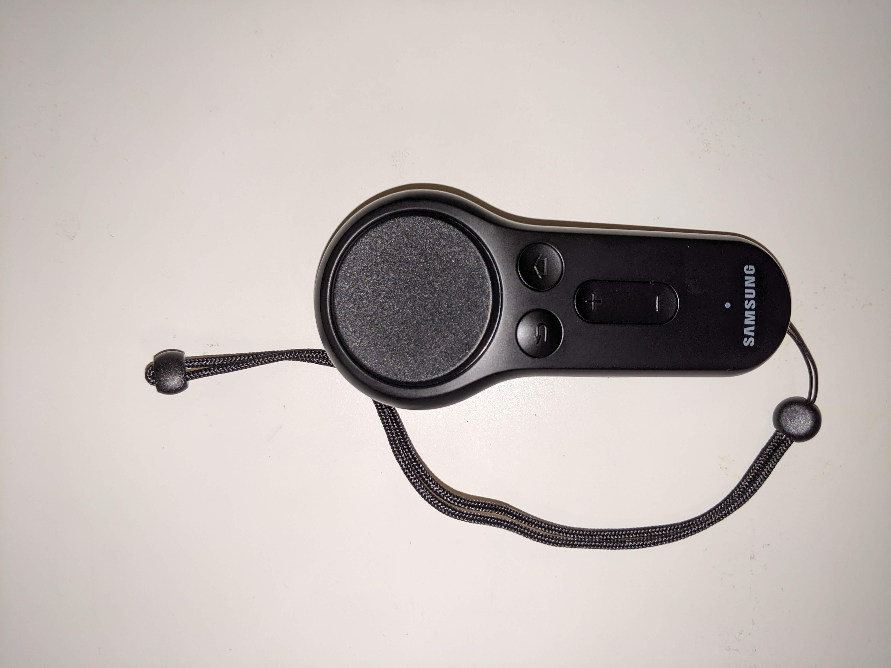

# gearvr-controller-uhid

## What is this for?

Using the [Samsung Gear VR Controller](https://www.samsung.com/global/galaxy/gear-vr/) in Linux.

In the words of Samsung:

> The Gear VR controller enhances your control over different VR apps and games.

### Controller Capabilities

* Touchpad with single-click button
* Trigger button
* Up/Down button pair
* Back button
* Home button (also for calibration)
* Accelerometer
* Gyroscope
* Magnetometer

### Available Modes (WIP)

* Mouse input 
    * touchpad for mouse movement
    * touchpad button for left click
    * trigger button for right click

## Where can I get one?
* [BestBuy](https://www.bestbuy.com/site/samsung-gear-vr-controller-black/5805800.p?ref=8575135&loc=e6141930f8d211e982de32e1bb81e18c0INT&acampID=e6141930f8d211e982de32e1bb81e18c0INT&skuId=5805800) was $1 or $2 for a while, may be sold out
* [Amazon](https://www.amazon.com/Samsung-ET-YO324BBEGUS-Gear-VR-Controller/dp/B06XHXRXP1/ref=sr_1_3?keywords=samsung+vr+controller&qid=1572577074&sr=8-3) $7-$8
* [Samsung](https://www.samsung.com/us/mobile/virtual-reality/gear-vr/vr-controller-et-yo324bbegus/) seems to be out of stock

## Credits

* Jim Yang: great post on reverse engineering the controller: https://jsyang.ca/hacks/gear-vr-rev-eng/
* Daniel Stiner: userpace HID library
* Attila Dusnoki: BlueZ + dbus library
